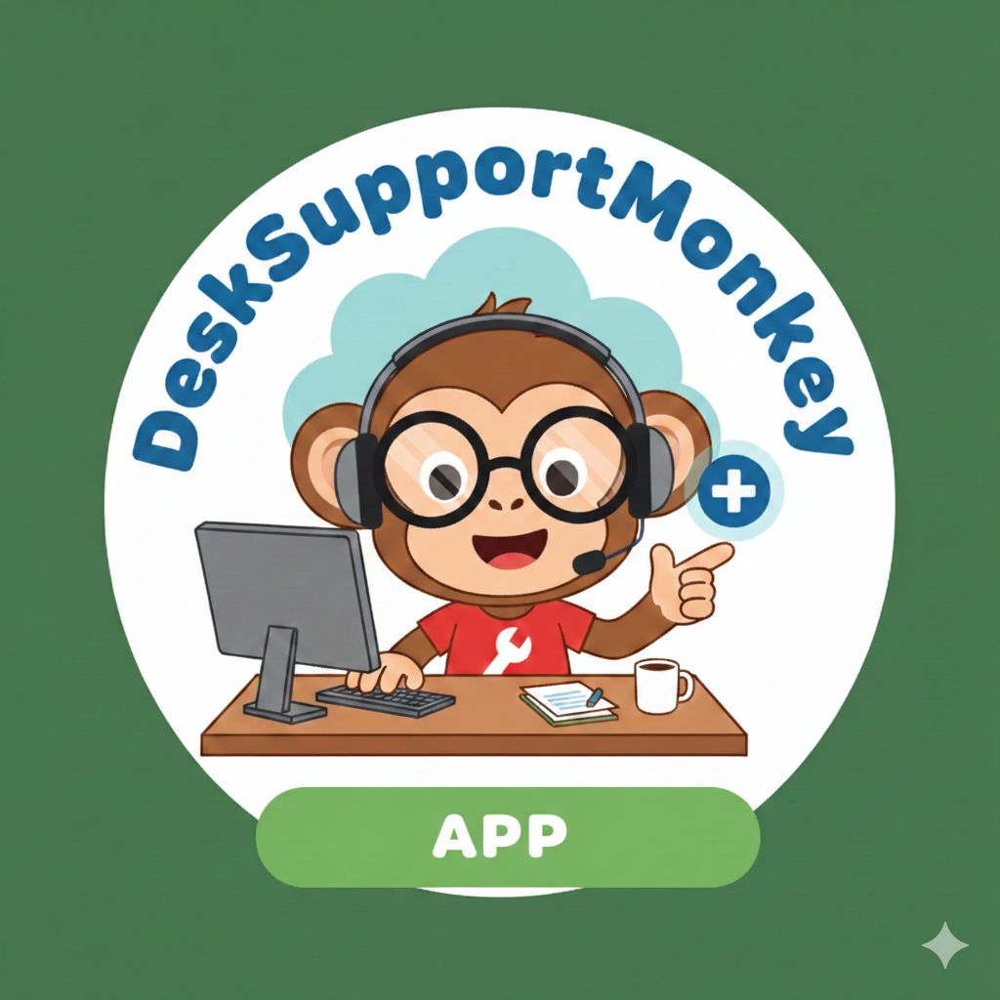

<p align="center">
  
</p>

# DeskSupportMonkey

**IT Service Desk & Asset Inventory Platform** — A full-stack, multi-tenant application built entirely with AI-assisted development to demonstrate how production-grade software can be designed, implemented, and validated using AI as a development partner.

---

## What Is This?

DeskSupportMonkey is a real, working IT service desk platform where companies manage their help desk tickets, IT asset inventory, users, departments, and reports. It supports multiple companies (multi-tenant), role-based access, real-time notifications, PDF report generation, and a modern React frontend.

**But more importantly**, this project is a demonstration of a structured AI development methodology. Every epic — from architecture decisions to code, tests, and validation — was developed through an AI agent pipeline that mirrors a professional software team's workflow.

### The AI Development Pipeline

The project includes 10 specialized AI agents (in `ai_docs/agents/`) that form a complete software development lifecycle:

```
REQUIREMENTS                    IMPLEMENTATION           VALIDATION
─────────────                   ──────────────           ──────────
1. Write requirement     ──►    Developer codes    ──►   5. Check Definition of Done
2. Validate requirement         (with AI pair)           6. Check Architecture (DDD/CQRS)
2.5. Slice into features                                 7. Check Code Quality (SOLID)
3. Design solution                                       8. Check Performance (N+1, indexes)
4. Generate tasks                                        9. Linter & Compile (mypy, flake8)
                                                        10. Testing (coverage, quality)
```

Each agent has a specific prompt and responsibilities. The pipeline ensures that requirements are validated before coding begins, and that every implementation is checked against architecture, quality, performance, and testing standards before it's considered done.

---

## Features

### By User Role

| Role | Capabilities |
|------|-------------|
| **Employee** | View assigned equipment, submit service requests (incidents, new equipment, onboarding), track request status, receive real-time notifications |
| **Technician** | Request queue with filters, assign/update request status, public comments and internal notes, asset inventory management, CSV asset import, warranty tracking |
| **Admin** | Dashboard with metrics and SLA alerts, user management and role assignment, department management, PDF report generation (asset inventory, request summary, technician performance) |
| **Super Admin** | Multi-tenant company management, company status control (active/suspended/deactivated) |

### Authentication

- **Magic link** passwordless login for all users
- **Email + password** login for admin accounts
- First-visit password setup flow for new admins
- JWT-based session management

### Platform Capabilities

- Multi-tenant architecture with company isolation
- Real-time WebSocket notifications
- Background PDF report generation (Celery)
- S3-compatible file storage (MinIO)
- Idempotent seed script for demo data with 3 sample companies

---

## Tech Stack

### Backend
| Component | Technology |
|-----------|-----------|
| Framework | FastAPI |
| Language | Python 3.13 |
| Database | PostgreSQL 15 |
| ORM | SQLAlchemy |
| Migrations | Alembic |
| Task Queue | Celery + Redis |
| Auth | JWT (PyJWT) + bcrypt |
| Email | SMTP (Mailpit for dev) |
| Storage | S3/MinIO |
| Package Manager | uv |

### Frontend
| Component | Technology |
|-----------|-----------|
| Framework | React 19 |
| Language | TypeScript 5.9 |
| Build Tool | Vite 7 |
| Styling | Tailwind CSS 4 |
| Data Fetching | TanStack React Query |
| Routing | React Router 7 |
| Charts | Recharts |
| HTTP Client | Axios |

### Infrastructure (Docker Compose)
| Service | Port | Purpose |
|---------|------|---------|
| PostgreSQL | 5443 | Database |
| Redis | 6398 | Celery broker and cache |
| Mailpit | 8028 (UI), 1028 (SMTP) | Email testing |
| MinIO | 9000 (S3), 9001 (Console) | File storage |

---

## Project Structure

```
desksupportmonkey/
│
├── src/                          # Backend domain logic (DDD bounded contexts)
│   ├── auth_bc/                  #   Authentication & authorization
│   │   ├── user/                 #     User management, roles, passwords
│   │   ├── magic_link/           #     Magic link token lifecycle
│   │   └── company_lookup/       #     Multi-tenant company identification
│   ├── company_bc/               #   Company & department management
│   │   ├── company/              #     Company CRUD, status, email domains
│   │   └── department/           #     Department CRUD within companies
│   ├── asset_bc/                 #   IT asset inventory
│   │   └── asset/                #     Asset CRUD, assignment, CSV import, events
│   ├── request_bc/               #   Service request management (core domain)
│   │   └── request/              #     Requests, comments, notes, status workflow
│   ├── notification_bc/          #   Real-time notification system
│   │   └── notification/         #     Notification storage, event bus, delivery
│   ├── report_bc/                #   Report generation
│   │   └── report/               #     PDF reports via Celery async tasks
│   └── framework/                #   Shared base classes (Command/Query bus)
│
├── adapters/                     # HTTP layer (Ports & Adapters pattern)
│   └── http/
│       ├── api/                  #   REST API routers and schemas
│       │   ├── auth/             #     Login, magic link, password, /me
│       │   ├── registration/     #     Company self-registration
│       │   ├── companies/        #     Company management (super admin)
│       │   ├── departments/      #     Department CRUD
│       │   ├── users/            #     User management & roles
│       │   ├── assets/           #     Asset CRUD, import, assignment
│       │   ├── requests/         #     Service request lifecycle
│       │   ├── my/               #     User-scoped endpoints (my equipment, my requests)
│       │   ├── dashboard/        #     Admin dashboard metrics & alerts
│       │   ├── reports/          #     Report generation & download
│       │   └── health/           #     Health check endpoint
│       ├── ws/                   #   WebSocket notification delivery
│       ├── middleware/           #   Error handlers
│       └── schemas/              #   Shared response schemas
│
├── core/                         # Shared infrastructure
│   ├── config.py                 #   Pydantic settings from environment
│   ├── database.py               #   SQLAlchemy engine & session
│   ├── jwt.py                    #   JWT token service
│   ├── password.py               #   bcrypt password hashing
│   ├── email.py                  #   SMTP email service
│   ├── storage.py                #   S3/MinIO file storage
│   ├── celery.py                 #   Celery worker configuration
│   ├── tenant.py                 #   Multi-tenancy context
│   ├── base.py                   #   SQLAlchemy declarative base
│   ├── mixins.py                 #   ULID and timestamp ORM mixins
│   └── tasks/                    #   Celery task definitions (reports)
│
├── web/app/                      # React frontend
│   └── src/
│       ├── pages/                #   Page components by role
│       │   ├── auth/             #     Login, register, verify, set-password
│       │   ├── employee/         #     My equipment, my requests, notifications
│       │   ├── technician/       #     Request queue, asset management
│       │   ├── admin/            #     Dashboard, users, departments, reports
│       │   └── superadmin/       #     Company management
│       ├── components/           #   Reusable components
│       │   ├── layout/           #     AppLayout, Sidebar, Header
│       │   └── ui/               #     Badge, Card, Table, Pagination, Loading
│       ├── contexts/             #   React contexts (AuthContext)
│       ├── hooks/                #   Custom hooks (WebSocket, notifications)
│       ├── lib/                  #   API client (Axios), utilities
│       ├── types/                #   TypeScript type definitions
│       └── router.tsx            #   Route definitions
│
├── tests/                        # Test suite (433 tests, 58 files)
│   ├── unit/                     #   Unit tests per bounded context
│   │   ├── auth_bc/              #     Auth tests (user, magic link, company lookup)
│   │   ├── company_bc/           #     Company & department tests
│   │   ├── asset_bc/             #     Asset management tests
│   │   ├── request_bc/           #     Service request tests
│   │   ├── notification_bc/      #     Notification tests
│   │   ├── report_bc/            #     Report generation tests
│   │   ├── dashboard/            #     Dashboard metrics tests
│   │   └── core/                 #     Infrastructure tests (JWT, password, storage)
│   └── integration/              #   Integration tests (WebSocket)
│
├── alembic/                      # Database migrations
│   └── versions/                 #   8 migration scripts
│
├── scripts/                      # Utility scripts
│   └── seed_demo_data.py         #   Idempotent demo data seeder (3 companies)
│
├── docs/                         # Product documentation
│   ├── product/                  #   Functional & technical requirements, roadmap
│   └── epics/                    #   9 epics with requirements, slicing, validation
│       ├── e0-foundation/        #     Project bootstrap & auth infrastructure
│       ├── e1-company-management/#     Company CRUD, departments, users
│       ├── e2-asset-inventory/   #     Asset CRUD, assignment, import
│       ├── e3-service-requests/  #     Request lifecycle, comments, notes
│       ├── e4-realtime-notifications/ # Event bus, WebSocket delivery
│       ├── e5-admin-dashboard/   #     Metrics, charts, SLA alerts
│       ├── e6-report-generation/ #     PDF reports via Celery
│       ├── e7-frontend/          #     React SPA setup
│       └── e8-seed-data-demo/    #     Demo data generation
│
├── ai_docs/                      # AI development pipeline
│   ├── agents/                   #   10 AI agent definitions (see below)
│   ├── architecture/             #   Architecture guides & critical rules
│   │   ├── critical-rules.md     #     Mandatory architecture rules
│   │   ├── architecture.md       #     DDD overview
│   │   ├── application-layer.md  #     CQRS commands & queries
│   │   ├── infrastructure.md     #     Repository & ORM patterns
│   │   ├── http-layer.md         #     Router & schema conventions
│   │   ├── code-quality.md       #     Naming & style conventions
│   │   ├── development-workflow.md#    End-to-end workflow guide
│   │   └── frontend/             #     Frontend architecture & standards
│   └── working_documentation.md  #   Document types reference
│
├── templates/                    # Jinja2 templates (PDF reports)
├── app.py                        # FastAPI application entry point
├── docker-compose.yml            # Development infrastructure
├── pyproject.toml                # Python dependencies & config
├── Makefile                      # Development commands
└── .env.example                  # Environment variable template
```

---

## Architecture

### Backend: DDD + Clean Architecture + CQRS

Each bounded context follows the same internal structure:

```
{bounded_context}_bc/{subdomain}/
├── domain/               # Pure business logic (no external dependencies)
│   ├── entities.py       #   Core domain objects
│   ├── enums.py          #   Domain enumerations
│   └── repository.py     #   Repository interface (port)
├── application/          # Use cases (orchestration)
│   ├── commands/         #   Write operations (create, update, delete)
│   └── queries/          #   Read operations (list, detail, search)
└── infrastructure/       # Technical implementations (adapters)
    ├── models.py         #   SQLAlchemy ORM models
    └── repository.py     #   Repository implementation
```

**Dependency rule**: Domain has zero external dependencies. Application depends on domain. Infrastructure implements domain interfaces. HTTP layer (adapters) orchestrates application commands and queries.

```
Adapters (HTTP)  ──►  Application (Commands/Queries)  ──►  Domain (Entities)
                                                              ▲
                      Infrastructure (Repos, Models)  ────────┘
                           implements interfaces
```

### Frontend: Component-based with role-based routing

The React app uses lazy loading, React Query for server state, and role-based page organization. Authentication state is managed via React Context with JWT tokens stored in localStorage.

---

## Quick Start

### Prerequisites

- Python 3.13+ with [uv](https://docs.astral.sh/uv/)
- Node.js 18+
- Docker and Docker Compose

### Setup

```bash
# 1. Clone and configure
git clone <repo-url> && cd desksupportmonkey
cp .env.example .env

# 2. Start infrastructure (PostgreSQL, Redis, Mailpit, MinIO)
make start-docker

# 3. Install all dependencies (backend + frontend)
make install

# 4. Apply database migrations
make db-upgrade

# 5. Load demo data (3 companies, users, assets, requests)
make seed

# 6. Start everything (backend + frontend + Celery worker)
make start
```

### Access Points

| Service | URL |
|---------|-----|
| Frontend | http://localhost:5173 |
| API (Swagger) | http://localhost:8000/docs |
| Mailpit (emails) | http://localhost:8028 |
| MinIO Console | http://localhost:9001 |

### Demo Accounts

Login via magic link — request one, then check Mailpit for the email:

| Company | Role | Email |
|---------|------|-------|
| *(global)* | Super Admin | admin@desksupportmonkey.com |
| TechCorp Inc | Admin | alice.smith@techcorp.com |
| TechCorp Inc | Technician | bob.johnson@techcorp.com |
| TechCorp Inc | Employee | dave.brown@techcorp.com |
| FinanceHub | Admin | iris.jackson@financehub.com |
| HealthCare Plus | Admin | quinn.taylor@healthcareplus.com |

Admin accounts can also log in with email + password after setting a password on first visit.

---

## Available Commands

```bash
# Development
make start                # Start all services
make stop                 # Stop all services
make start-backend        # Start FastAPI only
make start-frontend       # Start Vite dev server only
make queue                # Start Celery worker only

# Database
make db-upgrade           # Apply pending migrations
make db-migrate msg="x"   # Generate new migration
make db-downgrade         # Revert last migration
make demo-reset           # Wipe database and reseed

# Quality
make test                 # Run test suite (433 tests)
make lint                 # Run mypy + flake8

# Utilities
make seed                 # Load demo data
make logs                 # View Docker container logs
make clean                # Remove __pycache__ and caches
make help                 # Show all commands
```

---

## AI Agent Pipeline

The `ai_docs/agents/` directory contains 10 agent definitions that form a structured development workflow. These are prompt templates that can be used with Claude (or any AI assistant) to maintain consistency and quality throughout the project lifecycle.

### Requirements Phase

| Agent | Command | What It Does |
|-------|---------|-------------|
| 1. Requirement Writer | `/requirement-write` | Creates structured requirement documents from business needs |
| 2. Requirement Validator | `/requirement-validate` | Validates completeness: acceptance criteria, edge cases, constraints |
| 2.5. Requirement Slicer | `/requirement-slice` | Breaks large epics into independently deliverable features |
| 3. Solution Designer | `/requirement-design` | Produces technical design: entities, endpoints, data flow |
| 4. Task Generator | `/requirement-tasks` | Converts design into ordered implementation tasks |

### Validation Phase (post-implementation)

| Agent | Command | What It Does |
|-------|---------|-------------|
| 5. DoD Checker | `/check-dod` | Verifies all acceptance criteria are met |
| 6. Architecture Checker | `/check-architecture` | Validates DDD layers, CQRS, dependency direction |
| 7. Quality Checker | `/check-quality` | Reviews SOLID principles, code smells, naming |
| 8. Performance Checker | `/check-performance` | Detects N+1 queries, missing indexes, unbounded queries |
| 9. Linter | `/linter` | Runs mypy and flake8, reports type and style issues |
| 10. Testing Agent | `/testing` | Analyzes coverage, test quality, missing edge cases |

### Architecture Reference

The `ai_docs/architecture/` directory contains the rules and standards that all agents enforce:

- **`critical-rules.md`** — The 6 non-negotiable architecture rules
- **`architecture.md`** — DDD bounded context overview
- **`application-layer.md`** — CQRS command/query patterns
- **`infrastructure.md`** — Repository and ORM conventions
- **`http-layer.md`** — Router and schema standards
- **`code-quality.md`** — Naming and style guidelines
- **`frontend/`** — Frontend architecture, coding standards, component library

---

## Project Numbers

| Metric | Value |
|--------|-------|
| Python source files | 220 |
| TypeScript/React files | 36 |
| Test files | 58 |
| Test cases | 433 |
| Backend lines of code | ~9,400 |
| Frontend lines of code | ~2,500 |
| Test lines of code | ~6,100 |
| API endpoints | 50+ |
| Database tables | 15 |
| Alembic migrations | 8 |
| Epics delivered | 9 |
| AI agent definitions | 10 |

---

## License

This project is a demonstration of AI-assisted software development. Built by [Juan Macias](mailto:extjmv@gmail.com).
